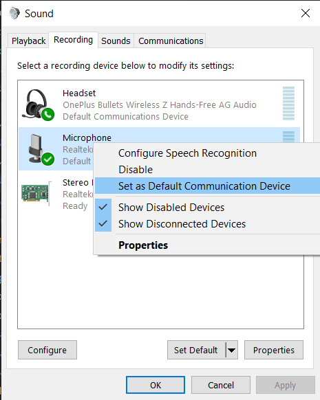

Last week I got new bluetooth headphones, the [Oneplus Bullets Wireless Z](https://www.oneplus.com/nl/product/oneplus-bullets-wireless-z) to be exact. I really like them, but when using them on Windows they sometimes freak out and stop playing sound altogether.

What really happens is that they start playing sound on the "hands-free" version of the device when a game accessess the microphone (note that it doesn't *use* it). This happens especially often in games because they often use get your audio input configured when loading the game.

The thing with the hands-free version is that it plays audio with a lower quality to decrease latency or something making it sound like I was listening to my game trough an old timey phone call. Not ideal to say the least.

The solution seemed simple enough: just force the program to use the normal version of the device through Windows audio settings.

It was quite easy to do except... it didn't seem to do anything! It would still play over the hands free version no matter what I did. I tried disabling the device, using some output switcher program and all sorts of other things I found in my Google searches, but nothing helped.

Until I disabled microphone access trough Windows while also disabling the hands-free version of the device. This worked, but felt a like a bad solution because it would simply mean I couldn't use a microphone and these headsets.

A day later I found an obscure post somewhere talking about communications devices and how they are different than microphones in Windows settings. This, it turned out, was my golden ticket. I went into Sound Control Panel, right-clicked my laptop microphone and clicked "Set as default communication device".

It worked! I'm now happily doing everything on my phone and laptop using my bluetooth headphones. I thought I'd share this with you since the internet didn't have a clear answer to my question.