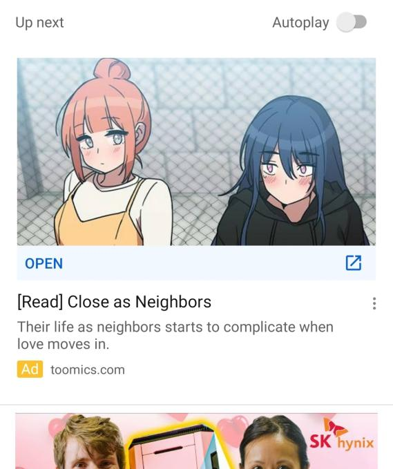

**These last 2 months I've been trying YouTube Premium, so here's a little review about it. In short: cool that you've got no ads, but the extra features seem unpolished and not thought out.**

So let's get some things straight: I've watched a lot of YouTube, but the last year I've been more into gaming. Thus my watching habit is usually between 1 and two hours a day (on average). I've taken the free YouTube Premium trial for two months that I got because I have a Samsung Galaxy A50. I canceled halfway through the trial and still got the entire free two week period.

I don't think anyone really likes ads, especially when you're trying to relax after a long day of work. Because of the current global pandemic, YouTube ads have also kind of gotten worse. Most big companies have cut budget on ads, thus allowing smaller ads to get a bigger audience. Anyway I got fed up with the weird ads that made no sense and finally got YouTube Premium.

So I haven't had a YouTube in ad in a while (except those build-in to the videos themself) and I must say it's great.

Another big feature is the option to automatically play videos in a pop-up player when switching to another app. I used to use multitasking in Android, but just having a pop-up player is quite nice for chatting and watching a video. The thing is that the pop-up player doesn't always listen to your commands and sometimes just freaks out. Not ideal if your putting it as a premium feature.

One thing I haven't really tried is background play. On like the first video YouTube will ask you if you want to enable background play, meaning that if you lock your phone the video audio keeps playing. I didn't like that, so I turned that off But when I wanted to try it out later, I was unable to turn it on. YouTube supports suggests to check under settings, but I can't find anything related to backgrounnd play. A button on the video woud've been a nice addition anyway.

So YouTube Premium, would I recommend? Not if you want to use it for the extra features because those are just not worth paying for. But as a paid ad-blocker for YouTube, perhaps if you don't like the gray area where apps like [NewPipe](https://newpipe.net/) live in. In the end, I'm not gonna resubscribe and just let the trial run out when it does.
